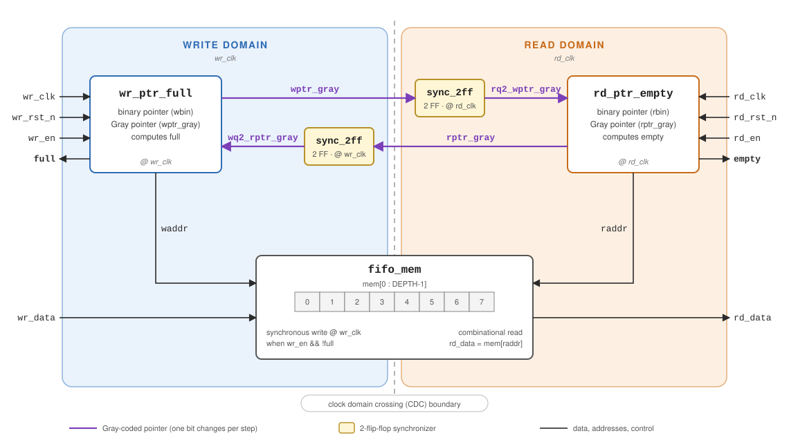
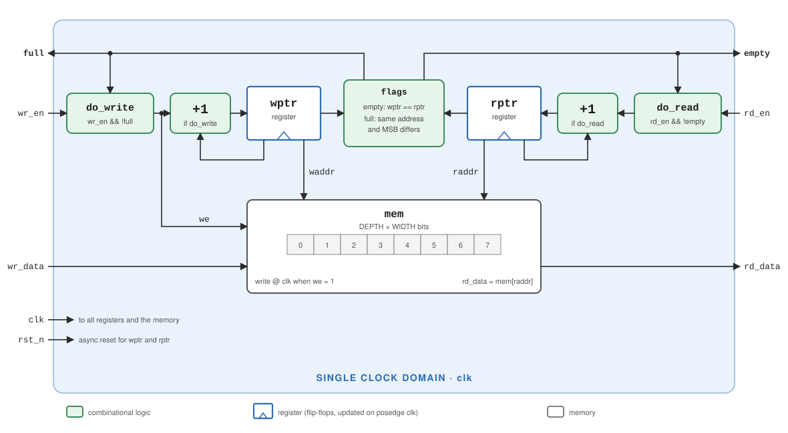
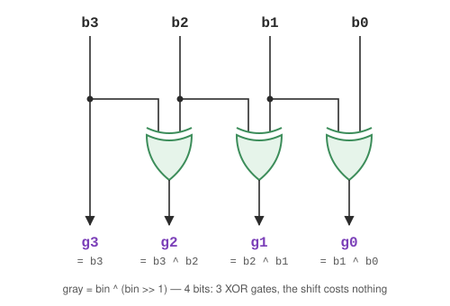

# async-fifo

Parameterizable asynchronous FIFO for passing data between two unrelated clock
domains. Written in SystemVerilog and verified with a testbench against a
reference model.

- [Block diagram](#block-diagram)
- [Interface](#interface)
- [Internal signals](#internal-signals)
- [Modules](#modules)
- [Running](#running)
- [How it works](#how-it-works)
- [Gray code](#gray-code)
- [Verification](#verification)
- [What I would do differently](#what-i-would-do-differently)

## Block diagram



- **Blue:** everything clocked by `wr_clk`.
- **Orange:** everything clocked by `rd_clk`.
- **Yellow:** the synchronizers, the only places where a signal enters the other domain.
- **Purple:** the Gray-coded pointers, the only signals that cross the boundary.

The memory is shared: the write domain writes into it and the read domain reads from it.

## Interface

Ports of the top-level module `async_fifo`.

### Parameters

| Parameter | Default | Description |
|---|---|---|
| `WIDTH` | 8 | Width of one data word, in bits |
| `DEPTH` | 8 | Number of FIFO entries. **Must be a power of 2** |

Internally, `ADDR_W = $clog2(DEPTH)` is the number of address bits (3 for `DEPTH = 8`).

### Write domain

| Signal | Dir | Width | Description |
|---|---|---|---|
| `wr_clk` | in | 1 | Write clock. Every signal in this table is synchronous to it |
| `wr_rst_n` | in | 1 | Asynchronous active-low reset. Clears the write pointer and `full`. Assumed to be released synchronously to `wr_clk` |
| `wr_en` | in | 1 | Write request. A write happens on the rising edge of `wr_clk` **only if** `wr_en = 1` and `full = 0`. Requests while `full = 1` are ignored |
| `wr_data` | in | `WIDTH` | Data to write, sampled on the same edge as `wr_en` |
| `full` | out | 1 | FIFO is full and accepts no more writes. Registered output. **Pessimistic:** it asserts on time, but can stay high for a few cycles after a read |

### Read domain

| Signal | Dir | Width | Description |
|---|---|---|---|
| `rd_clk` | in | 1 | Read clock. Every signal in this table is synchronous to it |
| `rd_rst_n` | in | 1 | Asynchronous active-low reset. Clears the read pointer and sets `empty`. Assumed to be released synchronously to `rd_clk` |
| `rd_en` | in | 1 | Read request. The current entry is consumed on the rising edge of `rd_clk` **only if** `rd_en = 1` and `empty = 0` |
| `rd_data` | out | `WIDTH` | Oldest entry in the FIFO. **First-word fall-through:** valid whenever `empty = 0`, with no extra cycle after `rd_en` |
| `empty` | out | 1 | FIFO is empty and `rd_data` is not valid. Registered output. **Pessimistic:** it asserts on time, but can stay high for a few cycles after a write |

### Usage

- **Write:** drive `wr_data` and `wr_en = 1`. If `full = 0` on the edge, the data is stored.
- **Read:** while `empty = 0`, `rd_data` holds the first entry. Drive `rd_en = 1` and the entry is consumed on the edge; `rd_data` then moves to the next one.
- A written word appears at the output after about **3 `rd_clk` edges**: 2 for synchronization and 1 for the `empty` register.

## Internal signals

| Signal | Width | Domain | Driven by | Description |
|---|---|---|---|---|
| `waddr` | `ADDR_W` | write | `wr_ptr_full` | Address being written. The binary pointer without its extra bit |
| `raddr` | `ADDR_W` | read | `rd_ptr_empty` | Address being read |
| `wptr_gray` | `ADDR_W+1` | write | `wr_ptr_full` | Gray-coded write pointer, straight from a register. Goes to the read domain |
| `rptr_gray` | `ADDR_W+1` | read | `rd_ptr_empty` | Gray-coded read pointer, straight from a register. Goes to the write domain |
| `rq2_wptr_gray` | `ADDR_W+1` | read | `u_sync_w2r` | `wptr_gray` after 2 flip-flops on `rd_clk`. Used to compute `empty` |
| `wq2_rptr_gray` | `ADDR_W+1` | write | `u_sync_r2w` | `rptr_gray` after 2 flip-flops on `wr_clk`. Used to compute `full` |
| `wr_en && !full` | 1 | write | `async_fifo` | Memory write enable. The same condition that advances the write pointer |

**Naming convention:** `wq2_rptr_gray` is the **r**ead pointer, passed through **2** flip-flops (**q2**), as seen in the **w**rite domain.

## Modules

| Module | File | Purpose |
|---|---|---|
| `async_fifo` | `rtl/async_fifo.sv` | Top level. Connects the other modules and has no logic of its own |
| `fifo_mem` | `rtl/fifo_mem.sv` | Dual-port memory |
| `wr_ptr_full` | `rtl/wr_ptr_full.sv` | Write pointer and `full` flag |
| `rd_ptr_empty` | `rtl/rd_ptr_empty.sv` | Read pointer and `empty` flag |
| `sync_2ff` | `rtl/sync_2ff.sv` | Two-flip-flop synchronizer |
| `sync_fifo` | `rtl/sync_fifo.sv` | Single-clock FIFO (warm-up, independent of the rest) |

### `async_fifo`: top level

Instantiates the blocks and connects them as shown in the block diagram. The
only logic here is the `wr_en && !full` write enable for the memory.

| Instance | Module | Domain | Role |
|---|---|---|---|
| `u_mem` | `fifo_mem` | both | Stores the data |
| `u_wr_ptr` | `wr_ptr_full` | write | Advances the write pointer, computes `full` |
| `u_rd_ptr` | `rd_ptr_empty` | read | Advances the read pointer, computes `empty` |
| `u_sync_r2w` | `sync_2ff` | write | Brings `rptr_gray` into the write domain |
| `u_sync_w2r` | `sync_2ff` | read | Brings `wptr_gray` into the read domain |

The ports are listed under [Interface](#interface).

### `fifo_mem`: dual-port memory

An array of `2^ADDR_W` words. Writes are synchronous to `wr_clk`; reads are
combinational (`rd_data = mem[raddr]`).

Reading combinationally from the other domain is safe. An entry only becomes
readable after `empty` goes low, which is at least 2–3 `rd_clk` edges after
the write, so by then the stored data has been stable for a long time.

| Parameter | Description |
|---|---|
| `WIDTH` | Word width |
| `ADDR_W` | Address bits; the memory has `2^ADDR_W` entries |

| Signal | Dir | Width | Description |
|---|---|---|---|
| `wr_clk` | in | 1 | Write clock |
| `wr_en` | in | 1 | Writes `wr_data` to `waddr` on the rising edge of `wr_clk`. Connected to `wr_en && !full` in the top level |
| `waddr` | in | `ADDR_W` | Write address |
| `wr_data` | in | `WIDTH` | Data to write |
| `raddr` | in | `ADDR_W` | Read address |
| `rd_data` | out | `WIDTH` | Contents of entry `raddr`, combinational |

### `wr_ptr_full`: write pointer and `full`

Runs entirely on `wr_clk`. On every edge:

1. If `wr_en && !full`, the binary pointer `wbin` increments by 1.
2. The new value is converted to Gray code (`gray = bin ^ (bin >> 1)`) and stored in the `wptr_gray` register.
3. `full` is recomputed by comparing the new Gray pointer with the synchronized read pointer:

```systemverilog
full <= (wgray_next == (wq2_rptr_gray ^ TOP2));   // TOP2 = 1100 for ADDR_W = 3
```

In words, the FIFO is full when the top two bits are inverted and all other bits
are equal (explained under [Full condition in Gray code](#full-condition-in-gray-code)).

| Parameter | Description |
|---|---|
| `ADDR_W` | Address bits; pointers are `ADDR_W+1` bits wide |

| Signal | Dir | Width | Description |
|---|---|---|---|
| `wr_clk` | in | 1 | Write clock |
| `wr_rst_n` | in | 1 | Asynchronous active-low reset: pointers to 0, `full` to 0 |
| `wr_en` | in | 1 | Write request |
| `wq2_rptr_gray` | in | `ADDR_W+1` | Gray-coded read pointer, already synchronized to `wr_clk` |
| `waddr` | out | `ADDR_W` | Write address (`wbin` without its MSB) |
| `wptr_gray` | out | `ADDR_W+1` | Gray-coded write pointer, registered |
| `full` | out | 1 | FIFO full, registered |

| Internal signal | Description |
|---|---|
| `wbin` | Binary write pointer, registered |
| `wbin_next` | `wbin + (wr_en && !full)`, the value after the current edge |
| `wgray_next` | `wbin_next` converted to Gray code |
| `TOP2` | Mask for the top two bits of the pointer |

The comparison uses `wgray_next` rather than `wptr_gray`. That way `full`
already accounts for the write on the current edge instead of lagging by a cycle.

### `rd_ptr_empty`: read pointer and `empty`

The mirror image of `wr_ptr_full`, on `rd_clk`. On every edge:

1. If `rd_en && !empty`, the binary pointer `rbin` increments by 1.
2. The new value is converted to Gray code and stored in `rptr_gray`.
3. `empty` is recomputed: the FIFO is empty when both Gray pointers are equal in every bit.

```systemverilog
empty <= (rgray_next == rq2_wptr_gray);
```

| Signal | Dir | Width | Description |
|---|---|---|---|
| `rd_clk` | in | 1 | Read clock |
| `rd_rst_n` | in | 1 | Asynchronous active-low reset: pointers to 0, `empty` to 1 |
| `rd_en` | in | 1 | Read request |
| `rq2_wptr_gray` | in | `ADDR_W+1` | Gray-coded write pointer, already synchronized to `rd_clk` |
| `raddr` | out | `ADDR_W` | Read address (`rbin` without its MSB) |
| `rptr_gray` | out | `ADDR_W+1` | Gray-coded read pointer, registered |
| `empty` | out | 1 | FIFO empty, registered |

The internal signals follow the same pattern: `rbin`, `rbin_next`, `rgray_next`.

### `sync_2ff`: synchronizer

Brings a signal from one clock domain into another through two flip-flops in series:

```
            ┌──────┐        ┌──────┐
   d  ────> │  FF  │ meta ─>│  FF  │ ───> q
            └──┬───┘        └──┬───┘
   clk ────────┴───────────────┘
```

The first flip-flop (`meta`) can go metastable if `d` changes right at the clock
edge. It then has a full clock period to settle before the second flip-flop
samples it.

When `WIDTH > 1`, each bit is synchronized independently, and different bits
can land in different cycles. That is why only Gray-coded pointers go through
here: they change a single bit per step.

The registers carry the `(* ASYNC_REG = "TRUE" *)` attribute, which tells Vivado
to place them close together, keep them from being optimized away, and treat
them correctly in timing analysis.

| Parameter | Description |
|---|---|
| `WIDTH` | Number of bits to synchronize (`ADDR_W+1` in the top level) |

| Signal | Dir | Width | Description |
|---|---|---|---|
| `clk` | in | 1 | Clock of the **destination** domain |
| `rst_n` | in | 1 | Asynchronous active-low reset of the destination domain |
| `d` | in | `WIDTH` | Signal coming from the other domain |
| `q` | out | `WIDTH` | Synchronized signal, delayed by 2 `clk` edges |

### `sync_fifo`: synchronous FIFO (warm-up)

A single-clock FIFO, independent of the rest of the project. It uses the same
extra-pointer-bit idea, but no Gray code and no synchronizers, because nothing
crosses a clock domain. The flags are combinational and **exact**.



- **Green:** combinational logic, which re-evaluates as soon as its inputs change.
- **White with a triangle:** registers (flip-flops), which update only on `posedge clk`.
- **The `+1` loops:** each register plus its adder forms a counter that advances only when enabled.
- **The `full → do_write` and `empty → do_read` loops:** the flags themselves block writes when full and reads when empty.

**What happens on a `clk` edge:**

1. *Before the edge*, the combinational logic has already computed `do_write = wr_en && !full` and `do_read = rd_en && !empty`.
2. *On the edge*:
   - if `do_write`: `mem[waddr] <= wr_data`, and `wptr` increments by 1;
   - if `do_read`: `rptr` increments by 1.
3. *After the edge*, `full` and `empty` are recomputed from the new pointers, and `rd_data = mem[raddr]` shows the next entry.

A written word is readable right after the write edge, because `empty` goes low in the same cycle.

| Internal signal | Width | Type | Description |
|---|---|---|---|
| `wptr` | `ADDR_W+1` | register | Write pointer, with the extra bit |
| `rptr` | `ADDR_W+1` | register | Read pointer, with the extra bit |
| `do_write` | 1 | combinational | `wr_en && !full`, meaning a write actually happens. Also the memory write enable (`we`) |
| `do_read` | 1 | combinational | `rd_en && !empty`, meaning a read actually happens |
| `waddr` | `ADDR_W` | wire | `wptr[ADDR_W-1:0]`, the pointer without its extra bit |
| `raddr` | `ADDR_W` | wire | `rptr[ADDR_W-1:0]` |

| | `sync_fifo` | `async_fifo` |
|---|---|---|
| Clocks | 1 | 2, unrelated |
| Pointers | binary | binary + Gray |
| Synchronizers | none | 2 × `sync_2ff` |
| `full` / `empty` | combinational, exact | registered, pessimistic |
| Write → readable | right after the edge | ~3 `rd_clk` edges |

| Signal | Dir | Width | Description |
|---|---|---|---|
| `clk` | in | 1 | Shared clock |
| `rst_n` | in | 1 | Asynchronous active-low reset |
| `wr_en` | in | 1 | Write request, accepted when `!full` |
| `wr_data` | in | `WIDTH` | Data to write |
| `full` | out | 1 | Full: same address, different extra bit |
| `rd_en` | in | 1 | Read request, accepted when `!empty` |
| `rd_data` | out | `WIDTH` | Oldest entry (first-word fall-through) |
| `empty` | out | 1 | Empty: pointers are identical |

### Testbenches

| File | What it does |
|---|---|
| `tb/tb_async_fifo.sv` | Two unrelated clocks (100 MHz / ~73 MHz), a queue as the reference model, 8 phases with different write/read rates, and a coverage summary. Dumps `build/wave.vcd` |
| `tb/tb_sync_fifo.sv` | Random test for `sync_fifo`; checks both flags exactly, in both directions |

## Running

```bash
make sim       # asynchronous FIFO, Icarus Verilog
make sim-sync  # synchronous FIFO (warm-up)
make wave      # open build/wave.vcd in GTKWave
```

Requires [Icarus Verilog](https://bleyer.org/icarus/) 12 or newer (GTKWave is bundled).

### Directory layout

```
async-fifo/
├── rtl/
│   ├── async_fifo.sv      top level
│   ├── fifo_mem.sv        dual-port memory
│   ├── wr_ptr_full.sv     write pointer + full
│   ├── rd_ptr_empty.sv    read pointer + empty
│   ├── sync_2ff.sv        2-FF synchronizer
│   └── sync_fifo.sv       synchronous FIFO (warm-up)
├── tb/
│   ├── tb_async_fifo.sv
│   └── tb_sync_fifo.sv
├── docs/
│   ├── en/                diagrams, English labels
│   └── *.svg              diagrams, Romanian labels
└── Makefile
```

## How it works

### The extra pointer bit

Pointers are `log2(DEPTH)+1` bits wide. The extra bit tells empty apart from
full. If the pointers are identical in every bit, the FIFO is empty. If the
address bits match but the extra bit differs, it is full.

| Case | `wbin` | `rbin` | |
|---|---|---|---|
| empty | `0011` | `0011` | identical |
| full | `1011` | `0011` | address `011` matches, MSB differs |

Why the pointers cross the boundary in Gray code, how the conversion works, and
how the empty and full conditions look are all covered in [Gray code](#gray-code).

### Life of a data word

1. **`wr_clk`, edge 0:** `wr_en = 1` and `full = 0`, so the data goes into memory, `wbin` increments and `wptr_gray` updates.
2. **`rd_clk`, edge 1:** the first flip-flop in `u_sync_w2r` captures the new `wptr_gray`.
3. **`rd_clk`, edge 2:** the value reaches `rq2_wptr_gray`.
4. **`rd_clk`, edge 3:** `rd_ptr_empty` sees different pointers, so `empty` goes low. `rd_data` already shows the word.
5. **First edge with `rd_en = 1`:** the word is consumed and `rbin` increments.

### Why the flags are pessimistic

Because of the two synchronization cycles, `full` can stay high briefly after
space has been freed. That costs some throughput, which is acceptable. The
opposite, a `full` that drops too late relative to writes, would mean lost data.

The same applies to `empty`. The read domain sees an old write pointer, so it
believes less has been written than really has. `empty` goes low late, but an
unwritten entry is never read.

## Gray code

### What it is

Gray code (also called *reflected binary code*) is an ordering of numbers in
which **any two consecutive values differ in exactly one bit**, including the
wrap from the last value back to 0.

| Decimal | Binary | Gray | Bits changed in binary | Bits changed in Gray |
|---|---|---|---|---|
| 0 | `000` | `000` | – | – |
| 1 | `001` | `001` | 1 | 1 |
| 2 | `010` | `011` | 2 | 1 |
| 3 | `011` | `010` | 1 | 1 |
| 4 | `100` | `110` | **3** | 1 |
| 5 | `101` | `111` | 1 | 1 |
| 6 | `110` | `101` | 2 | 1 |
| 7 | `111` | `100` | 1 | 1 |
| 0 | `000` | `000` | **3** | 1 |

A binary increment can flip any number of bits. A Gray increment always flips exactly one.

Gray code is not meant for arithmetic, and you cannot add in it directly. So the
pointers are incremented in binary and converted to Gray only to cross the
boundary.

### How it is built: by reflection

Start from 1 bit (`0`, `1`). To add one more bit:

1. write down the existing list;
2. write it again below, in reverse order (the mirror image);
3. prefix the first half with `0` and the mirrored half with `1`.

```
 1 bit     2 bits      3 bits
   0        0 0         0 00
   1        0 1         0 01
           ─────        0 11
            1 1         0 10
            1 0        ──────   ← mirror
                        1 10
                        1 11
                        1 01
                        1 00
```

At the seam between the halves only the new bit changes, because the rest is a
mirror image. Inside each half, the one-bit property comes from the previous
list. The same reflection is also where the [full condition](#full-condition-in-gray-code) comes from.

### Binary to Gray conversion

```systemverilog
assign wgray_next = (wbin_next >> 1) ^ wbin_next;   // wr_ptr_full.sv
assign rgray_next = (rbin_next >> 1) ^ rbin_next;   // rd_ptr_empty.sv
```

Two operations are involved:

| Operation | Symbol | What it does | Hardware cost |
|---|---|---|---|
| Logical shift right by 1 | `>> 1` | Moves every bit one position right. Bit 0 drops out and a `0` enters at the MSB | **No gates.** Shifting by a constant is just rewiring |
| Bitwise exclusive OR (XOR) | `^` | For each position: `1` if the bits differ, `0` if they are equal | One XOR gate per bit |

| a | b | a ^ b |
|---|---|---|
| 0 | 0 | 0 |
| 0 | 1 | 1 |
| 1 | 0 | 1 |
| 1 | 1 | 0 |

Two XOR properties are used throughout the rest of this section:
`x ^ 0 = x` leaves a bit unchanged, and `x ^ 1 = !x` inverts it.

Bit by bit, for an `N`-bit pointer:

```
g[N-1] = b[N-1]            // b[N-1] ^ 0, just a wire
g[i]   = b[i+1] ^ b[i]     // for i = N-2 ... 0
```

In other words, **a Gray bit is 1 when the binary bit in the same position differs from its left neighbour.**



Worked example, `bin = 11`:

```
  bin        1 0 1 1
  bin >> 1   0 1 0 1     ← bits moved one position right, 0 enters on the left
  ───────────────── XOR
  Gray       1 1 1 0
```

Position by position: `1^0 = 1`, `0^1 = 1`, `1^0 = 1`, `1^1 = 0`, which gives `1110`, i.e. Gray(11).

### Why exactly one bit changes

Adding 1 to a binary number turns every trailing `1` into `0` and the lowest
`0` into `1`. If `k` is the position of that lowest `0`, then **bits 0…k flip**
and the bits above stay the same.

Applied to `g[i] = b[i+1] ^ b[i]`:

- **i < k:** both `b[i]` and `b[i+1]` flip. Two flips inside an XOR cancel out, so `g[i]` stays the same.
- **i = k:** `b[k]` flips and `b[k+1]` does not, so `g[k]` flips.
- **i > k:** nothing changes, so `g[i]` stays the same.

So **exactly one Gray bit changes: `g[k]`**.

Example 7 → 8, the worst case in binary:

```
            b3 b2 b1 b0            g3 g2 g1 g0
   7    =    0  1  1  1    Gray     0  1  0  0
   8    =    1  0  0  0    Gray     1  1  0  0
 changed     ✱  ✱  ✱  ✱             ✱  ·  ·  ·
```

The lowest `0` in `0111` is bit 3, so `k = 3` and only `g3` changes.

**Wrapping to 0** (15 → 0 on 4 bits): `1111 + 1 = 0000`, so every bit flips.
`g2…g0` see both neighbours flip and stay the same, while `g3 = b3` flips.
The result is `1000 → 0000`, still a single bit.

### Why `DEPTH` must be a power of 2

The argument above only holds if the pointer walks through **all** `2^N` values
and wraps to 0 by natural overflow. If you forced a 3-bit counter to wrap from
5 back to 0:

```
5 = 101  → Gray 111
0 = 000  → Gray 000     ← 3 bits change at once
```

The synchronizer could then capture an in-between combination, which is exactly
the problem Gray code was supposed to prevent.

### Gray to binary conversion

**Not used** in this project, because the `full` and `empty` comparisons are done
directly in Gray code. You would need it to know *how many* entries are in the
FIFO (for an `almost_full` flag, say), since subtraction is done in binary.

Each binary bit is the XOR of the binary bit above it and the Gray bit in the
same position:

```
b[N-1] = g[N-1]
b[i]   = b[i+1] ^ g[i]     // from the top down
```

```systemverilog
always_comb begin
  bin[N-1] = gray[N-1];
  for (int i = N-2; i >= 0; i--)
    bin[i] = bin[i+1] ^ gray[i];
end
```

Example `1110`: `b3 = 1`, `b2 = 1^1 = 0`, `b1 = 0^1 = 1`, `b0 = 1^0 = 1`, which gives `1011` = 11.

In binary-to-Gray, all XORs work **in parallel** (a single gate level). In
Gray-to-binary, each bit depends on the one above it, so the XORs form a
**chain** `N-1` levels deep, which is slower for wide pointers.

### Why Gray code instead of binary

A two-flip-flop synchronizer protects a single bit. A 4-bit pointer's bits do
not arrive in the other domain at the same moment, so a transition such as
`0111 → 1000` can be sampled as a value that never existed. In Gray code
consecutive values differ in one bit, so sampling during a transition yields
either the old value or the new one.

Concretely, during `0111 → 1000` all four bits are switching, and each reaches
the synchronizer with a slightly different delay. If the `rd_clk` edge lands
right then, the synchronizer can capture `1111`, `0000`, `1100` or any other
mix, and comparing that against the read pointer produces a completely wrong
`empty`. In Gray code the same step is `0100 → 1100`: only `g3` is switching,
so the result is either `0100` (7) or `1100` (8). Both are real values; at
worst the change is seen one cycle later.

### Why the Gray pointer must come straight from a register

`wptr_gray` and `rptr_gray` are registers, not `assign`s. If the combinational
output `(bin >> 1) ^ bin` fed the synchronizer directly, the XOR gates would
settle with different delays after each edge, and the output could briefly pass
through values with several bits changed (glitches). The one-bit property holds
only for the *final* values, not while they propagate. A register fixes this,
because its output changes once, cleanly, on the clock edge.

### Empty condition in Gray code

Empty means the pointers are identical in every bit. Every number has exactly
one Gray code and vice versa, so "equal in binary" is the same as "equal in Gray":

```systemverilog
empty <= (rgray_next == rq2_wptr_gray);
```

### Full condition in Gray code

| bin | Gray | | bin | Gray |
|---|---|---|---|---|
| 0 | `0000` | | 8 | `1100` |
| 1 | `0001` | | 9 | `1101` |
| 2 | `0011` | | 10 | `1111` |
| 3 | `0010` | | 11 | `1110` |
| 4 | `0110` | | 12 | `1010` |
| 5 | `0111` | | 13 | `1011` |
| 6 | `0101` | | 14 | `1001` |
| 7 | `0100` | | 15 | `1000` |

Full means `wbin = rbin + DEPTH`. For example, `rbin = 3` → `0010` and
`wbin = 11` → `1110`: the **top two bits** differ and the rest are equal. The
second half of the Gray sequence is a mirror of the first half with the MSB set,
and that mirroring also inverts the bit just below the MSB. Inverting only the
MSB would give `1010` = Gray(12), which is wrong.

In the code, the two bits are inverted by XOR-ing with a mask:

```systemverilog
localparam logic [ADDR_W:0] TOP2 = 3 << (ADDR_W - 1);   // ADDR_W = 3 → 1100
full <= (wgray_next == (wq2_rptr_gray ^ TOP2));
```

`^ 1100` inverts the bits where the mask is `1` and leaves them alone where it
is `0`, so a single comparison checks "top two bits different, the rest equal".

### Where Gray code appears in the source

| File | Code | Role |
|---|---|---|
| `wr_ptr_full.sv` | `wgray_next = (wbin_next >> 1) ^ wbin_next` | Binary to Gray conversion |
| `wr_ptr_full.sv` | `wptr_gray <= wgray_next` | Register that sends the Gray pointer to the read domain |
| `wr_ptr_full.sv` | `full <= (wgray_next == (wq2_rptr_gray ^ TOP2))` | Full condition |
| `rd_ptr_empty.sv` | `rgray_next = (rbin_next >> 1) ^ rbin_next` | Binary to Gray conversion |
| `rd_ptr_empty.sv` | `rptr_gray <= rgray_next` | Register that sends the Gray pointer to the write domain |
| `rd_ptr_empty.sv` | `empty <= (rgray_next == rq2_wptr_gray)` | Empty condition |
| `sync_2ff.sv` | `meta <= d; q_r <= meta;` | Carries the Gray pointer across the boundary |

## Verification

- Reference model: a software queue compared against the DUT
- Constrained-random stimulus with varying write/read rates
- Coverage: full, empty, almost full, almost empty, relative rates
- Assertions: no write when full, no read when empty, data order preserved
- **Bug hunting:** the `injected-bugs` branch contains 3 deliberate defects
  (single-register synchronizer, binary pointers, wrong full comparison), and
  the testbench catches all of them

## What I would do differently

The memory is inferred as registers rather than block RAM. For large depths, a
block RAM should be instantiated explicitly.
