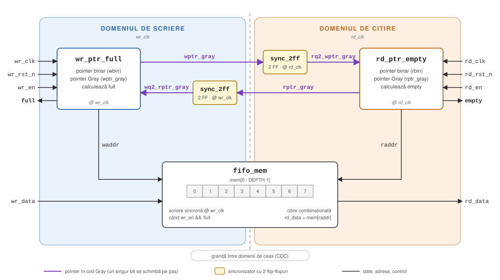

# async-fifo

FIFO asincron parametrizabil pentru transfer de date între două domenii
de ceas necorelate. SystemVerilog, verificat cu testbench cu model de referință.

- [Schemă bloc](#schemă-bloc)
- [Interfață](#interfață)
- [Semnale interne](#semnale-interne)
- [Module](#module)
- [Cum se rulează](#cum-se-rulează)
- [Cum funcționează](#cum-funcționează)
- [Verificare](#verificare)
- [Ce aș face diferit](#ce-aș-face-diferit)

## Schemă bloc



- **Albastru:** tot ce rulează pe `wr_clk`.
- **Portocaliu:** tot ce rulează pe `rd_clk`.
- **Galben:** sincronizatoarele, singurele locuri unde un semnal intră în alt domeniu.
- **Mov:** pointerii în cod Gray, singurele semnale care traversează granița.

Memoria e comună: scrie în ea domeniul de scriere, citește din ea domeniul de citire.

## Interfață

Porturile modulului de top `async_fifo`.

### Parametri

| Parametru | Implicit | Descriere |
|---|---|---|
| `WIDTH` | 8 | Lățimea unui cuvânt de date, în biți |
| `DEPTH` | 8 | Numărul de locații din FIFO. **Trebuie să fie putere a lui 2** |

Intern: `ADDR_W = $clog2(DEPTH)` — numărul de biți de adresă (3 pentru `DEPTH = 8`).

### Domeniul de scriere

| Semnal | Dir | Lățime | Descriere |
|---|---|---|---|
| `wr_clk` | in | 1 | Ceasul de scriere. Toate semnalele din acest tabel sunt sincrone cu el |
| `wr_rst_n` | in | 1 | Reset asincron, activ pe 0. Aduce pointerul de scriere la 0 și `full` la 0. Se presupune eliberat sincron cu `wr_clk` |
| `wr_en` | in | 1 | Cerere de scriere. Scrierea are loc pe frontul lui `wr_clk` **doar dacă** `wr_en = 1` și `full = 0`. Pe `full = 1` cererea e ignorată |
| `wr_data` | in | `WIDTH` | Datele de scris, eșantionate pe același front ca `wr_en` |
| `full` | out | 1 | FIFO-ul e plin, nu mai acceptă scrieri. Ieșire de registru. **Pesimist:** se ridică la timp, dar poate coborî cu câteva cicluri întârziere după o citire |

### Domeniul de citire

| Semnal | Dir | Lățime | Descriere |
|---|---|---|---|
| `rd_clk` | in | 1 | Ceasul de citire. Toate semnalele din acest tabel sunt sincrone cu el |
| `rd_rst_n` | in | 1 | Reset asincron, activ pe 0. Aduce pointerul de citire la 0 și `empty` la 1. Se presupune eliberat sincron cu `rd_clk` |
| `rd_en` | in | 1 | Cerere de citire. Elementul curent e consumat pe frontul lui `rd_clk` **doar dacă** `rd_en = 1` și `empty = 0` |
| `rd_data` | out | `WIDTH` | Elementul cel mai vechi din FIFO. **First-word-fall-through:** e valid oricând `empty = 0`, fără să aștepți un ciclu după `rd_en` |
| `empty` | out | 1 | FIFO-ul e gol, `rd_data` nu e valid. Ieșire de registru. **Pesimist:** se ridică la timp, dar poate coborî cu câteva cicluri întârziere după o scriere |

### Cum se folosește

- **Scriere:** pui `wr_data` și `wr_en = 1`. Dacă pe front `full = 0`, datele au intrat.
- **Citire:** cât timp `empty = 0`, `rd_data` e primul element. Pui `rd_en = 1` și pe front elementul e consumat; `rd_data` trece la următorul.
- O dată scrisă apare la ieșire după aproximativ **3 fronturi de `rd_clk`** (2 de sincronizare + 1 pentru registrul `empty`).

## Semnale interne

| Semnal | Lățime | Domeniu | Produs de | Descriere |
|---|---|---|---|---|
| `waddr` | `ADDR_W` | scriere | `wr_ptr_full` | Adresa locației în care se scrie. Pointerul binar fără bitul suplimentar |
| `raddr` | `ADDR_W` | citire | `rd_ptr_empty` | Adresa locației din care se citește |
| `wptr_gray` | `ADDR_W+1` | scriere | `wr_ptr_full` | Pointerul de scriere în cod Gray, ieșire directă de registru. Pleacă spre domeniul de citire |
| `rptr_gray` | `ADDR_W+1` | citire | `rd_ptr_empty` | Pointerul de citire în cod Gray, ieșire directă de registru. Pleacă spre domeniul de scriere |
| `rq2_wptr_gray` | `ADDR_W+1` | citire | `u_sync_w2r` | `wptr_gray` după 2 flip-flopuri pe `rd_clk`. Folosit la calculul lui `empty` |
| `wq2_rptr_gray` | `ADDR_W+1` | scriere | `u_sync_r2w` | `rptr_gray` după 2 flip-flopuri pe `wr_clk`. Folosit la calculul lui `full` |
| `wr_en && !full` | 1 | scriere | `async_fifo` | Enable-ul de scriere al memoriei. Aceeași condiție după care avansează și pointerul |

**Convenția de nume:** `wq2_rptr_gray` = pointerul de **r**ead, trecut prin **2** flip-flopuri (**q2**), văzut în domeniul de **w**rite.

## Module

| Modul | Fișier | Rol pe scurt |
|---|---|---|
| `async_fifo` | `rtl/async_fifo.sv` | Top. Leagă celelalte module, nu are logică proprie |
| `fifo_mem` | `rtl/fifo_mem.sv` | Memoria dual-port |
| `wr_ptr_full` | `rtl/wr_ptr_full.sv` | Pointerul de scriere și flag-ul `full` |
| `rd_ptr_empty` | `rtl/rd_ptr_empty.sv` | Pointerul de citire și flag-ul `empty` |
| `sync_2ff` | `rtl/sync_2ff.sv` | Sincronizator cu 2 flip-flopuri |
| `sync_fifo` | `rtl/sync_fifo.sv` | FIFO sincron, pe un singur ceas (încălzire, independent de restul) |

### `async_fifo` — modulul de top

Instanțiază blocurile și le conectează ca în schema bloc. Singura logică de aici
e condiția `wr_en && !full` pentru enable-ul memoriei.

| Instanță | Modul | Domeniu | Rol |
|---|---|---|---|
| `u_mem` | `fifo_mem` | ambele | Stochează datele |
| `u_wr_ptr` | `wr_ptr_full` | scriere | Avansează pointerul de scriere, calculează `full` |
| `u_rd_ptr` | `rd_ptr_empty` | citire | Avansează pointerul de citire, calculează `empty` |
| `u_sync_r2w` | `sync_2ff` | scriere | Aduce `rptr_gray` în domeniul de scriere |
| `u_sync_w2r` | `sync_2ff` | citire | Aduce `wptr_gray` în domeniul de citire |

Porturile sunt cele din [Interfață](#interfață).

### `fifo_mem` — memoria dual-port

Un tablou de `2^ADDR_W` cuvinte. Scrierea e sincronă pe `wr_clk`; citirea e
combinațională (`rd_data = mem[raddr]`).

Citirea combinațională din alt domeniu e sigură: o locație devine citibilă doar
după ce `empty` coboară, adică la cel puțin 2–3 fronturi de `rd_clk` după
scriere. Până atunci datele sunt de mult stabile.

| Parametru | Descriere |
|---|---|
| `WIDTH` | Lățimea unui cuvânt |
| `ADDR_W` | Biți de adresă; memoria are `2^ADDR_W` locații |

| Semnal | Dir | Lățime | Descriere |
|---|---|---|---|
| `wr_clk` | in | 1 | Ceasul de scriere |
| `wr_en` | in | 1 | Scrie `wr_data` la `waddr` pe frontul lui `wr_clk`. În top e legat la `wr_en && !full` |
| `waddr` | in | `ADDR_W` | Adresa de scriere |
| `wr_data` | in | `WIDTH` | Datele de scris |
| `raddr` | in | `ADDR_W` | Adresa de citire |
| `rd_data` | out | `WIDTH` | Conținutul locației `raddr`, combinațional |

### `wr_ptr_full` — pointerul de scriere și `full`

Rulează integral pe `wr_clk`. La fiecare front:

1. Dacă `wr_en && !full`, pointerul binar `wbin` crește cu 1.
2. Noua valoare e convertită în Gray (`gray = bin ^ (bin >> 1)`) și salvată în registrul `wptr_gray`.
3. `full` se recalculează comparând noul pointer Gray cu pointerul de citire sincronizat:

```systemverilog
full <= (wgray_next == (wq2_rptr_gray ^ TOP2));   // TOP2 = 1100 pentru ADDR_W = 3
```

Adică: plin când cei doi biți de sus sunt inversați și restul egali
(explicația la [Condiția de plin în cod Gray](#condiția-de-plin-în-cod-gray)).

| Parametru | Descriere |
|---|---|
| `ADDR_W` | Biți de adresă; pointerii au `ADDR_W+1` biți |

| Semnal | Dir | Lățime | Descriere |
|---|---|---|---|
| `wr_clk` | in | 1 | Ceasul de scriere |
| `wr_rst_n` | in | 1 | Reset asincron activ pe 0: pointeri la 0, `full` la 0 |
| `wr_en` | in | 1 | Cerere de scriere |
| `wq2_rptr_gray` | in | `ADDR_W+1` | Pointerul de citire, Gray, deja sincronizat în `wr_clk` |
| `waddr` | out | `ADDR_W` | Adresa de scriere (`wbin` fără MSB) |
| `wptr_gray` | out | `ADDR_W+1` | Pointerul de scriere în Gray, ieșire de registru |
| `full` | out | 1 | FIFO plin, ieșire de registru |

| Semnal intern | Descriere |
|---|---|
| `wbin` | Pointerul de scriere în binar, registru |
| `wbin_next` | `wbin + (wr_en && !full)` — valoarea de după frontul curent |
| `wgray_next` | `wbin_next` convertit în Gray |
| `TOP2` | Masca pentru cei doi biți de sus ai pointerului |

Se compară `wgray_next`, nu `wptr_gray`: așa `full` reflectă deja scrierea de
pe frontul curent și nu întârzie cu un ciclu.

### `rd_ptr_empty` — pointerul de citire și `empty`

Oglinda lui `wr_ptr_full`, pe `rd_clk`. La fiecare front:

1. Dacă `rd_en && !empty`, pointerul binar `rbin` crește cu 1.
2. Noua valoare e convertită în Gray și salvată în `rptr_gray`.
3. `empty` se recalculează: gol când pointerii Gray sunt identici pe toți biții.

```systemverilog
empty <= (rgray_next == rq2_wptr_gray);
```

| Semnal | Dir | Lățime | Descriere |
|---|---|---|---|
| `rd_clk` | in | 1 | Ceasul de citire |
| `rd_rst_n` | in | 1 | Reset asincron activ pe 0: pointeri la 0, `empty` la 1 |
| `rd_en` | in | 1 | Cerere de citire |
| `rq2_wptr_gray` | in | `ADDR_W+1` | Pointerul de scriere, Gray, deja sincronizat în `rd_clk` |
| `raddr` | out | `ADDR_W` | Adresa de citire (`rbin` fără MSB) |
| `rptr_gray` | out | `ADDR_W+1` | Pointerul de citire în Gray, ieșire de registru |
| `empty` | out | 1 | FIFO gol, ieșire de registru |

Semnalele interne sunt analoage: `rbin`, `rbin_next`, `rgray_next`.

### `sync_2ff` — sincronizatorul

Aduce un semnal dintr-un domeniu de ceas în altul prin două flip-flopuri în serie:

```
            ┌──────┐        ┌──────┐
   d  ────> │  FF  │ meta ─>│  FF  │ ───> q
            └──┬───┘        └──┬───┘
   clk ────────┴───────────────┘
```

Primul flip-flop (`meta`) poate intra în metastabilitate dacă `d` se schimbă
chiar pe front. Are o perioadă întreagă de ceas să se stabilizeze înainte ca al
doilea să-l eșantioneze.

Pentru `WIDTH > 1`, biții se sincronizează independent și pot ajunge în cicluri
diferite. De aceea pe aici trec doar pointeri Gray, unde se schimbă un singur bit
pe pas.

Registrele au atributul `(* ASYNC_REG = "TRUE" *)`: Vivado le plasează apropiat,
nu le optimizează și le tratează corect în analiza de timing.

| Parametru | Descriere |
|---|---|
| `WIDTH` | Numărul de biți sincronizați (în top: `ADDR_W+1`) |

| Semnal | Dir | Lățime | Descriere |
|---|---|---|---|
| `clk` | in | 1 | Ceasul domeniului **destinație** |
| `rst_n` | in | 1 | Reset asincron activ pe 0, al domeniului destinație |
| `d` | in | `WIDTH` | Semnalul venit din celălalt domeniu |
| `q` | out | `WIDTH` | Semnalul sincronizat, întârziat cu 2 fronturi de `clk` |

### `sync_fifo` — FIFO sincron (încălzire)

FIFO pe un singur ceas, independent de restul proiectului. Aceeași idee cu bitul
suplimentar în pointeri, dar fără cod Gray și fără sincronizatoare, pentru că
nimic nu traversează domenii. Flag-urile sunt combinaționale și **exacte**.

| Semnal | Dir | Lățime | Descriere |
|---|---|---|---|
| `clk` | in | 1 | Ceasul comun |
| `rst_n` | in | 1 | Reset asincron activ pe 0 |
| `wr_en` | in | 1 | Cerere de scriere, acceptată dacă `!full` |
| `wr_data` | in | `WIDTH` | Datele de scris |
| `full` | out | 1 | Plin: adresele egale, bitul suplimentar diferit |
| `rd_en` | in | 1 | Cerere de citire, acceptată dacă `!empty` |
| `rd_data` | out | `WIDTH` | Elementul cel mai vechi (first-word-fall-through) |
| `empty` | out | 1 | Gol: pointerii identici |

### Testbench-uri

| Fișier | Ce face |
|---|---|
| `tb/tb_async_fifo.sv` | Două ceasuri necorelate (100 MHz / ~73 MHz), coadă ca model de referință, 8 faze cu rate diferite de scriere/citire, sumar de coverage. Scrie `build/wave.vcd` |
| `tb/tb_sync_fifo.sv` | Test random pentru `sync_fifo`; verifică flag-urile exact, în ambele sensuri |

## Cum se rulează

```bash
make sim       # FIFO asincron, Icarus Verilog
make sim-sync  # FIFO sincron (încălzire)
make wave      # deschide GTKWave pe build/wave.vcd
```

Necesită [Icarus Verilog](https://bleyer.org/icarus/) ≥ 12 (include și GTKWave).

### Structură

```
async-fifo/
├── rtl/
│   ├── async_fifo.sv      top
│   ├── fifo_mem.sv        memorie dual-port
│   ├── wr_ptr_full.sv     pointer de scriere + full
│   ├── rd_ptr_empty.sv    pointer de citire + empty
│   ├── sync_2ff.sv        sincronizator cu 2 FF
│   └── sync_fifo.sv       FIFO sincron (încălzire)
├── tb/
│   ├── tb_async_fifo.sv
│   └── tb_sync_fifo.sv
├── docs/
│   └── async_fifo_block.svg
└── Makefile
```

## Cum funcționează

### Bitul suplimentar

Pointerii sunt pe `log2(DEPTH)+1` biți. Bitul suplimentar distinge
gol de plin: pointeri identici complet = gol, identici pe adresă
dar diferiți pe bitul suplimentar = plin.

| Situație | `wbin` | `rbin` | |
|---|---|---|---|
| gol | `0011` | `0011` | identici complet |
| plin | `1011` | `0011` | adresa `011` egală, MSB diferit |

### De ce cod Gray și nu binar

Un sincronizator cu două flip-flopuri protejează un singur bit.
Pointerul are 4 biți care nu ajung simultan în celălalt domeniu —
la trecerea de la 0111 la 1000 se pot citi valori care n-au existat
niciodată. În cod Gray se schimbă un singur bit între valori
consecutive, deci eșantionarea în timpul tranziției dă ori valoarea
veche, ori pe cea nouă.

### Condiția de plin în cod Gray

| bin | Gray | | bin | Gray |
|---|---|---|---|---|
| 0 | `0000` | | 8 | `1100` |
| 1 | `0001` | | 9 | `1101` |
| 2 | `0011` | | 10 | `1111` |
| 3 | `0010` | | 11 | `1110` |
| 4 | `0110` | | 12 | `1010` |
| 5 | `0111` | | 13 | `1011` |
| 6 | `0101` | | 14 | `1001` |
| 7 | `0100` | | 15 | `1000` |

Plin înseamnă `wbin = rbin + DEPTH`. De exemplu `rbin = 3` → `0010` și
`wbin = 11` → `1110`: diferă **primii doi biți**, restul sunt egali.
A doua jumătate a secvenței Gray e prima jumătate în oglindă, cu MSB-ul pe 1 —
oglindirea inversează și bitul de sub MSB. Dacă ai inversa doar MSB-ul, ai
obține `1010` = Gray(12), greșit.

### Parcursul unei date

1. **`wr_clk`, front 0:** `wr_en = 1`, `full = 0` → datele intră în memorie, `wbin` crește, `wptr_gray` se actualizează.
2. **`rd_clk`, front 1:** primul flip-flop din `u_sync_w2r` prinde noul `wptr_gray`.
3. **`rd_clk`, front 2:** valoarea ajunge în `rq2_wptr_gray`.
4. **`rd_clk`, front 3:** `rd_ptr_empty` vede pointerii diferiți → `empty` coboară. `rd_data` arată deja datele.
5. **Primul front cu `rd_en = 1`:** elementul e consumat, `rbin` crește.

### De ce flag-urile sunt pesimiste

Din cauza celor două cicluri de sincronizare, `full` poate rămâne
ridicat scurt timp după ce s-a eliberat spațiu. Pierdere de
performanță, acceptabilă. Inversul — `full` care se lasă prea
târziu — înseamnă date pierdute.

Același lucru pentru `empty`: domeniul de citire vede un pointer de scriere
vechi, deci crede că s-a scris mai puțin decât în realitate. `empty` coboară
târziu, dar niciodată nu se citește o locație nescrisă.

## Verificare

- Model de referință: coadă software comparată cu DUT-ul
- Stimuli constrained random, rate de scriere/citire variabile
- Coverage: plin, gol, aproape-plin, aproape-gol, rate relative
- Assertions: fără scriere pe full, fără citire pe empty, ordine păstrată
- **Bug hunting**: ramura `injected-bugs` conține 3 defecte
  intenționate (sincronizator cu un registru, pointeri binari,
  comparație greșită la full) — toate prinse de testbench

## Ce aș face diferit

Memoria e inferată ca registre, nu ca block RAM. Pentru adâncimi
mari ar trebui instanțiat explicit un bloc RAM.
