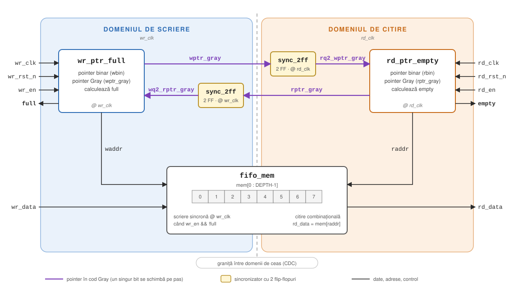
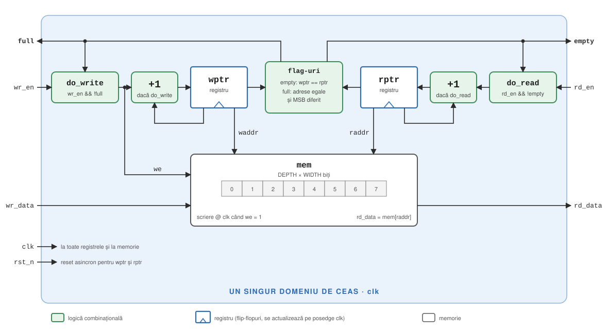
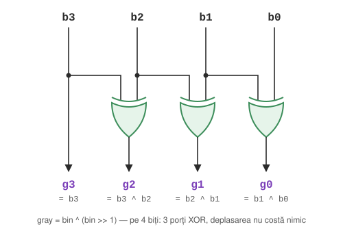

# async-fifo

FIFO asincron parametrizabil pentru transfer de date între două domenii
de ceas necorelate. SystemVerilog, verificat cu testbench cu model de referință.

- [Schemă bloc](#schemă-bloc)
- [Interfață](#interfață)
- [Semnale interne](#semnale-interne)
- [Module](#module)
- [Cum se rulează](#cum-se-rulează)
- [Cum funcționează](#cum-funcționează)
- [Codul Gray](#codul-gray)
- [Verificare](#verificare)
- [Ce aș face diferit](#ce-aș-face-diferit)

## Schemă bloc



- **Albastru:** tot ce rulează pe `wr_clk`.
- **Portocaliu:** tot ce rulează pe `rd_clk`.
- **Galben:** sincronizatoarele, singurele locuri unde un semnal intră în alt domeniu.
- **Mov:** pointerii în cod Gray, singurele semnale care traversează granița.

Memoria e comună: scrie în ea domeniul de scriere, citește din ea domeniul de citire.

## Interfață

Porturile modulului de top `async_fifo`.

### Parametri

| Parametru | Implicit | Descriere |
|---|---|---|
| `WIDTH` | 8 | Lățimea unui cuvânt de date, în biți |
| `DEPTH` | 8 | Numărul de locații din FIFO. **Trebuie să fie putere a lui 2** |

Intern: `ADDR_W = $clog2(DEPTH)` — numărul de biți de adresă (3 pentru `DEPTH = 8`).

### Domeniul de scriere

| Semnal | Dir | Lățime | Descriere |
|---|---|---|---|
| `wr_clk` | in | 1 | Ceasul de scriere. Toate semnalele din acest tabel sunt sincrone cu el |
| `wr_rst_n` | in | 1 | Reset asincron, activ pe 0. Aduce pointerul de scriere la 0 și `full` la 0. Se presupune eliberat sincron cu `wr_clk` |
| `wr_en` | in | 1 | Cerere de scriere. Scrierea are loc pe frontul lui `wr_clk` **doar dacă** `wr_en = 1` și `full = 0`. Pe `full = 1` cererea e ignorată |
| `wr_data` | in | `WIDTH` | Datele de scris, eșantionate pe același front ca `wr_en` |
| `full` | out | 1 | FIFO-ul e plin, nu mai acceptă scrieri. Ieșire de registru. **Pesimist:** se ridică la timp, dar poate coborî cu câteva cicluri întârziere după o citire |

### Domeniul de citire

| Semnal | Dir | Lățime | Descriere |
|---|---|---|---|
| `rd_clk` | in | 1 | Ceasul de citire. Toate semnalele din acest tabel sunt sincrone cu el |
| `rd_rst_n` | in | 1 | Reset asincron, activ pe 0. Aduce pointerul de citire la 0 și `empty` la 1. Se presupune eliberat sincron cu `rd_clk` |
| `rd_en` | in | 1 | Cerere de citire. Elementul curent e consumat pe frontul lui `rd_clk` **doar dacă** `rd_en = 1` și `empty = 0` |
| `rd_data` | out | `WIDTH` | Elementul cel mai vechi din FIFO. **First-word-fall-through:** e valid oricând `empty = 0`, fără să aștepți un ciclu după `rd_en` |
| `empty` | out | 1 | FIFO-ul e gol, `rd_data` nu e valid. Ieșire de registru. **Pesimist:** se ridică la timp, dar poate coborî cu câteva cicluri întârziere după o scriere |

### Cum se folosește

- **Scriere:** pui `wr_data` și `wr_en = 1`. Dacă pe front `full = 0`, datele au intrat.
- **Citire:** cât timp `empty = 0`, `rd_data` e primul element. Pui `rd_en = 1` și pe front elementul e consumat; `rd_data` trece la următorul.
- O dată scrisă apare la ieșire după aproximativ **3 fronturi de `rd_clk`** (2 de sincronizare + 1 pentru registrul `empty`).

## Semnale interne

| Semnal | Lățime | Domeniu | Produs de | Descriere |
|---|---|---|---|---|
| `waddr` | `ADDR_W` | scriere | `wr_ptr_full` | Adresa locației în care se scrie. Pointerul binar fără bitul suplimentar |
| `raddr` | `ADDR_W` | citire | `rd_ptr_empty` | Adresa locației din care se citește |
| `wptr_gray` | `ADDR_W+1` | scriere | `wr_ptr_full` | Pointerul de scriere în cod Gray, ieșire directă de registru. Pleacă spre domeniul de citire |
| `rptr_gray` | `ADDR_W+1` | citire | `rd_ptr_empty` | Pointerul de citire în cod Gray, ieșire directă de registru. Pleacă spre domeniul de scriere |
| `rq2_wptr_gray` | `ADDR_W+1` | citire | `u_sync_w2r` | `wptr_gray` după 2 flip-flopuri pe `rd_clk`. Folosit la calculul lui `empty` |
| `wq2_rptr_gray` | `ADDR_W+1` | scriere | `u_sync_r2w` | `rptr_gray` după 2 flip-flopuri pe `wr_clk`. Folosit la calculul lui `full` |
| `wr_en && !full` | 1 | scriere | `async_fifo` | Enable-ul de scriere al memoriei. Aceeași condiție după care avansează și pointerul |

**Convenția de nume:** `wq2_rptr_gray` = pointerul de **r**ead, trecut prin **2** flip-flopuri (**q2**), văzut în domeniul de **w**rite.

## Module

| Modul | Fișier | Rol pe scurt |
|---|---|---|
| `async_fifo` | `rtl/async_fifo.sv` | Top. Leagă celelalte module, nu are logică proprie |
| `fifo_mem` | `rtl/fifo_mem.sv` | Memoria dual-port |
| `wr_ptr_full` | `rtl/wr_ptr_full.sv` | Pointerul de scriere și flag-ul `full` |
| `rd_ptr_empty` | `rtl/rd_ptr_empty.sv` | Pointerul de citire și flag-ul `empty` |
| `sync_2ff` | `rtl/sync_2ff.sv` | Sincronizator cu 2 flip-flopuri |
| `sync_fifo` | `rtl/sync_fifo.sv` | FIFO sincron, pe un singur ceas (încălzire, independent de restul) |

### `async_fifo` — modulul de top

Instanțiază blocurile și le conectează ca în schema bloc. Singura logică de aici
e condiția `wr_en && !full` pentru enable-ul memoriei.

| Instanță | Modul | Domeniu | Rol |
|---|---|---|---|
| `u_mem` | `fifo_mem` | ambele | Stochează datele |
| `u_wr_ptr` | `wr_ptr_full` | scriere | Avansează pointerul de scriere, calculează `full` |
| `u_rd_ptr` | `rd_ptr_empty` | citire | Avansează pointerul de citire, calculează `empty` |
| `u_sync_r2w` | `sync_2ff` | scriere | Aduce `rptr_gray` în domeniul de scriere |
| `u_sync_w2r` | `sync_2ff` | citire | Aduce `wptr_gray` în domeniul de citire |

Porturile sunt cele din [Interfață](#interfață).

### `fifo_mem` — memoria dual-port

Un tablou de `2^ADDR_W` cuvinte. Scrierea e sincronă pe `wr_clk`; citirea e
combinațională (`rd_data = mem[raddr]`).

Citirea combinațională din alt domeniu e sigură: o locație devine citibilă doar
după ce `empty` coboară, adică la cel puțin 2–3 fronturi de `rd_clk` după
scriere. Până atunci datele sunt de mult stabile.

| Parametru | Descriere |
|---|---|
| `WIDTH` | Lățimea unui cuvânt |
| `ADDR_W` | Biți de adresă; memoria are `2^ADDR_W` locații |

| Semnal | Dir | Lățime | Descriere |
|---|---|---|---|
| `wr_clk` | in | 1 | Ceasul de scriere |
| `wr_en` | in | 1 | Scrie `wr_data` la `waddr` pe frontul lui `wr_clk`. În top e legat la `wr_en && !full` |
| `waddr` | in | `ADDR_W` | Adresa de scriere |
| `wr_data` | in | `WIDTH` | Datele de scris |
| `raddr` | in | `ADDR_W` | Adresa de citire |
| `rd_data` | out | `WIDTH` | Conținutul locației `raddr`, combinațional |

### `wr_ptr_full` — pointerul de scriere și `full`

Rulează integral pe `wr_clk`. La fiecare front:

1. Dacă `wr_en && !full`, pointerul binar `wbin` crește cu 1.
2. Noua valoare e convertită în Gray (`gray = bin ^ (bin >> 1)`) și salvată în registrul `wptr_gray`.
3. `full` se recalculează comparând noul pointer Gray cu pointerul de citire sincronizat:

```systemverilog
full <= (wgray_next == (wq2_rptr_gray ^ TOP2));   // TOP2 = 1100 pentru ADDR_W = 3
```

Adică: plin când cei doi biți de sus sunt inversați și restul egali
(explicația la [Condiția de plin în cod Gray](#condiția-de-plin-în-cod-gray)).

| Parametru | Descriere |
|---|---|
| `ADDR_W` | Biți de adresă; pointerii au `ADDR_W+1` biți |

| Semnal | Dir | Lățime | Descriere |
|---|---|---|---|
| `wr_clk` | in | 1 | Ceasul de scriere |
| `wr_rst_n` | in | 1 | Reset asincron activ pe 0: pointeri la 0, `full` la 0 |
| `wr_en` | in | 1 | Cerere de scriere |
| `wq2_rptr_gray` | in | `ADDR_W+1` | Pointerul de citire, Gray, deja sincronizat în `wr_clk` |
| `waddr` | out | `ADDR_W` | Adresa de scriere (`wbin` fără MSB) |
| `wptr_gray` | out | `ADDR_W+1` | Pointerul de scriere în Gray, ieșire de registru |
| `full` | out | 1 | FIFO plin, ieșire de registru |

| Semnal intern | Descriere |
|---|---|
| `wbin` | Pointerul de scriere în binar, registru |
| `wbin_next` | `wbin + (wr_en && !full)` — valoarea de după frontul curent |
| `wgray_next` | `wbin_next` convertit în Gray |
| `TOP2` | Masca pentru cei doi biți de sus ai pointerului |

Se compară `wgray_next`, nu `wptr_gray`: așa `full` reflectă deja scrierea de
pe frontul curent și nu întârzie cu un ciclu.

### `rd_ptr_empty` — pointerul de citire și `empty`

Oglinda lui `wr_ptr_full`, pe `rd_clk`. La fiecare front:

1. Dacă `rd_en && !empty`, pointerul binar `rbin` crește cu 1.
2. Noua valoare e convertită în Gray și salvată în `rptr_gray`.
3. `empty` se recalculează: gol când pointerii Gray sunt identici pe toți biții.

```systemverilog
empty <= (rgray_next == rq2_wptr_gray);
```

| Semnal | Dir | Lățime | Descriere |
|---|---|---|---|
| `rd_clk` | in | 1 | Ceasul de citire |
| `rd_rst_n` | in | 1 | Reset asincron activ pe 0: pointeri la 0, `empty` la 1 |
| `rd_en` | in | 1 | Cerere de citire |
| `rq2_wptr_gray` | in | `ADDR_W+1` | Pointerul de scriere, Gray, deja sincronizat în `rd_clk` |
| `raddr` | out | `ADDR_W` | Adresa de citire (`rbin` fără MSB) |
| `rptr_gray` | out | `ADDR_W+1` | Pointerul de citire în Gray, ieșire de registru |
| `empty` | out | 1 | FIFO gol, ieșire de registru |

Semnalele interne sunt analoage: `rbin`, `rbin_next`, `rgray_next`.

### `sync_2ff` — sincronizatorul

Aduce un semnal dintr-un domeniu de ceas în altul prin două flip-flopuri în serie:

```
            ┌──────┐        ┌──────┐
   d  ────> │  FF  │ meta ─>│  FF  │ ───> q
            └──┬───┘        └──┬───┘
   clk ────────┴───────────────┘
```

Primul flip-flop (`meta`) poate intra în metastabilitate dacă `d` se schimbă
chiar pe front. Are o perioadă întreagă de ceas să se stabilizeze înainte ca al
doilea să-l eșantioneze.

Pentru `WIDTH > 1`, biții se sincronizează independent și pot ajunge în cicluri
diferite. De aceea pe aici trec doar pointeri Gray, unde se schimbă un singur bit
pe pas.

Registrele au atributul `(* ASYNC_REG = "TRUE" *)`: Vivado le plasează apropiat,
nu le optimizează și le tratează corect în analiza de timing.

| Parametru | Descriere |
|---|---|
| `WIDTH` | Numărul de biți sincronizați (în top: `ADDR_W+1`) |

| Semnal | Dir | Lățime | Descriere |
|---|---|---|---|
| `clk` | in | 1 | Ceasul domeniului **destinație** |
| `rst_n` | in | 1 | Reset asincron activ pe 0, al domeniului destinație |
| `d` | in | `WIDTH` | Semnalul venit din celălalt domeniu |
| `q` | out | `WIDTH` | Semnalul sincronizat, întârziat cu 2 fronturi de `clk` |

### `sync_fifo` — FIFO sincron (încălzire)

FIFO pe un singur ceas, independent de restul proiectului. Aceeași idee cu bitul
suplimentar în pointeri, dar fără cod Gray și fără sincronizatoare, pentru că
nimic nu traversează domenii. Flag-urile sunt combinaționale și **exacte**.



- **Verde:** logică combinațională — se recalculează imediat ce se schimbă intrările.
- **Alb cu triunghi:** registre (flip-flopuri) — se actualizează doar pe `posedge clk`.
- **Buclele `+1`:** registrul plus sumatorul formează un numărător care avansează doar când e activat.
- **Buclele `full → do_write` și `empty → do_read`:** flag-urile blochează singure scrierea pe plin și citirea pe gol.

**Ce se întâmplă la un front de `clk`:**

1. *Înainte de front*, logica combinațională a calculat deja `do_write = wr_en && !full` și `do_read = rd_en && !empty`.
2. *Pe front*:
   - dacă `do_write`: `mem[waddr] <= wr_data` și `wptr` crește cu 1;
   - dacă `do_read`: `rptr` crește cu 1.
3. *După front*: `full` și `empty` se recalculează din noii pointeri, iar `rd_data = mem[raddr]` arată următorul element.

O dată scrisă e disponibilă la citire imediat după frontul de scriere: `empty` coboară în același ciclu.

| Semnal intern | Lățime | Tip | Descriere |
|---|---|---|---|
| `wptr` | `ADDR_W+1` | registru | Pointerul de scriere, cu bit suplimentar |
| `rptr` | `ADDR_W+1` | registru | Pointerul de citire, cu bit suplimentar |
| `do_write` | 1 | combinațional | `wr_en && !full` — scrierea chiar are loc; e și write-enable-ul memoriei (`we`) |
| `do_read` | 1 | combinațional | `rd_en && !empty` — citirea chiar are loc |
| `waddr` | `ADDR_W` | fir | `wptr[ADDR_W-1:0]`, pointerul fără bitul suplimentar |
| `raddr` | `ADDR_W` | fir | `rptr[ADDR_W-1:0]` |

| | `sync_fifo` | `async_fifo` |
|---|---|---|
| Ceasuri | 1 | 2, necorelate |
| Pointeri | binari | binari + Gray |
| Sincronizatoare | nu | 2 × `sync_2ff` |
| `full` / `empty` | combinaționale, exacte | registre, pesimiste |
| Scriere → disponibil la citire | imediat după front | ~3 fronturi de `rd_clk` |

| Semnal | Dir | Lățime | Descriere |
|---|---|---|---|
| `clk` | in | 1 | Ceasul comun |
| `rst_n` | in | 1 | Reset asincron activ pe 0 |
| `wr_en` | in | 1 | Cerere de scriere, acceptată dacă `!full` |
| `wr_data` | in | `WIDTH` | Datele de scris |
| `full` | out | 1 | Plin: adresele egale, bitul suplimentar diferit |
| `rd_en` | in | 1 | Cerere de citire, acceptată dacă `!empty` |
| `rd_data` | out | `WIDTH` | Elementul cel mai vechi (first-word-fall-through) |
| `empty` | out | 1 | Gol: pointerii identici |

### Testbench-uri

| Fișier | Ce face |
|---|---|
| `tb/tb_async_fifo.sv` | Două ceasuri necorelate (100 MHz / ~73 MHz), coadă ca model de referință, 8 faze cu rate diferite de scriere/citire, sumar de coverage. Scrie `build/wave.vcd` |
| `tb/tb_sync_fifo.sv` | Test random pentru `sync_fifo`; verifică flag-urile exact, în ambele sensuri |

## Cum se rulează

```bash
make sim       # FIFO asincron, Icarus Verilog
make sim-sync  # FIFO sincron (încălzire)
make wave      # deschide GTKWave pe build/wave.vcd
```

Necesită [Icarus Verilog](https://bleyer.org/icarus/) ≥ 12 (include și GTKWave).

### Structură

```
async-fifo/
├── rtl/
│   ├── async_fifo.sv      top
│   ├── fifo_mem.sv        memorie dual-port
│   ├── wr_ptr_full.sv     pointer de scriere + full
│   ├── rd_ptr_empty.sv    pointer de citire + empty
│   ├── sync_2ff.sv        sincronizator cu 2 FF
│   └── sync_fifo.sv       FIFO sincron (încălzire)
├── tb/
│   ├── tb_async_fifo.sv
│   └── tb_sync_fifo.sv
├── docs/
│   ├── async_fifo_block.svg   schemă bloc FIFO asincron
│   ├── sync_fifo_block.svg    schemă bloc FIFO sincron
│   └── bin2gray.svg           circuitul binar → Gray
└── Makefile
```

## Cum funcționează

### Bitul suplimentar

Pointerii sunt pe `log2(DEPTH)+1` biți. Bitul suplimentar distinge
gol de plin: pointeri identici complet = gol, identici pe adresă
dar diferiți pe bitul suplimentar = plin.

| Situație | `wbin` | `rbin` | |
|---|---|---|---|
| gol | `0011` | `0011` | identici complet |
| plin | `1011` | `0011` | adresa `011` egală, MSB diferit |

De ce pointerii traversează granița în cod Gray, cum se calculează și cum arată
condițiile de gol și plin: în secțiunea [Codul Gray](#codul-gray).

### Parcursul unei date

1. **`wr_clk`, front 0:** `wr_en = 1`, `full = 0` → datele intră în memorie, `wbin` crește, `wptr_gray` se actualizează.
2. **`rd_clk`, front 1:** primul flip-flop din `u_sync_w2r` prinde noul `wptr_gray`.
3. **`rd_clk`, front 2:** valoarea ajunge în `rq2_wptr_gray`.
4. **`rd_clk`, front 3:** `rd_ptr_empty` vede pointerii diferiți → `empty` coboară. `rd_data` arată deja datele.
5. **Primul front cu `rd_en = 1`:** elementul e consumat, `rbin` crește.

### De ce flag-urile sunt pesimiste

Din cauza celor două cicluri de sincronizare, `full` poate rămâne
ridicat scurt timp după ce s-a eliberat spațiu. Pierdere de
performanță, acceptabilă. Inversul — `full` care se lasă prea
târziu — înseamnă date pierdute.

Același lucru pentru `empty`: domeniul de citire vede un pointer de scriere
vechi, deci crede că s-a scris mai puțin decât în realitate. `empty` coboară
târziu, dar niciodată nu se citește o locație nescrisă.

## Codul Gray

### Ce este

Codul Gray (numit și *reflected binary code*) este o ordonare a numerelor în care
**două valori consecutive diferă printr-un singur bit** — inclusiv la revenirea
de la ultima valoare la 0.

| Zecimal | Binar | Gray | Biți schimbați în binar | Biți schimbați în Gray |
|---|---|---|---|---|
| 0 | `000` | `000` | – | – |
| 1 | `001` | `001` | 1 | 1 |
| 2 | `010` | `011` | 2 | 1 |
| 3 | `011` | `010` | 1 | 1 |
| 4 | `100` | `110` | **3** | 1 |
| 5 | `101` | `111` | 1 | 1 |
| 6 | `110` | `101` | 2 | 1 |
| 7 | `111` | `100` | 1 | 1 |
| 0 | `000` | `000` | **3** | 1 |

În binar, o incrementare poate schimba oricâți biți. În Gray, mereu exact unul.

Gray nu e un cod pentru aritmetică — nu poți aduna direct în el. De aceea
pointerii se incrementează în binar și se convertesc în Gray doar ca să
traverseze granița.

### Cum se construiește: prin reflexie

Pornești de la 1 bit (`0`, `1`). Pentru un bit în plus:

1. scrii lista existentă;
2. dedesubt o scrii în oglindă (de jos în sus);
3. pui `0` în fața primei jumătăți și `1` în fața celei oglindite.

```
 1 bit     2 biți      3 biți
   0        0 0         0 00
   1        0 1         0 01
           ─────        0 11
            1 1         0 10
            1 0        ──────   ← oglinda
                        1 10
                        1 11
                        1 01
                        1 00
```

La granița dintre jumătăți se schimbă doar bitul nou adăugat (restul e identic,
fiind oglindă). În interiorul fiecărei jumătăți proprietatea vine din lista
anterioară. Tot din oglindire vine și [condiția de plin](#condiția-de-plin-în-cod-gray).

### Conversia binar → Gray

```systemverilog
assign wgray_next = (wbin_next >> 1) ^ wbin_next;   // wr_ptr_full.sv
assign rgray_next = (rbin_next >> 1) ^ rbin_next;   // rd_ptr_empty.sv
```

Se folosesc două operații:

| Operație | Simbol | Ce face | Cost în hardware |
|---|---|---|---|
| Deplasare logică la dreapta cu 1 | `>> 1` | Mută toți biții cu o poziție spre dreapta. Bitul 0 iese, în MSB intră `0` | **Zero porți** — o deplasare cu o constantă e doar o reconectare a firelor |
| SAU-exclusiv (XOR) bit cu bit | `^` | Pe fiecare poziție: `1` dacă biții diferă, `0` dacă sunt egali | O poartă XOR pe bit |

| a | b | a ^ b |
|---|---|---|
| 0 | 0 | 0 |
| 0 | 1 | 1 |
| 1 | 0 | 1 |
| 1 | 1 | 0 |

Două proprietăți ale lui XOR folosite peste tot mai jos:
`x ^ 0 = x` (lasă bitul neschimbat) și `x ^ 1 = !x` (îl inversează).

Scris bit cu bit, pentru un pointer pe `N` biți:

```
g[N-1] = b[N-1]            // b[N-1] ^ 0 — un simplu fir
g[i]   = b[i+1] ^ b[i]     // pentru i = N-2 ... 0
```

Adică **un bit Gray e 1 când bitul binar de pe aceeași poziție diferă de vecinul lui din stânga.**



Exemplu pas cu pas, `bin = 11`:

```
  bin        1 0 1 1
  bin >> 1   0 1 0 1     ← biții mutați o poziție la dreapta, 0 intră în stânga
  ───────────────── XOR
  Gray       1 1 1 0
```

Pe poziții: `1^0 = 1`, `0^1 = 1`, `1^0 = 1`, `1^1 = 0` → `1110`, adică Gray(11).

### De ce se schimbă un singur bit

Când aduni 1 la un număr binar, toți biții de `1` de la coadă devin `0`, iar
primul `0` devine `1`. Dacă `k` e poziția celui mai de jos bit `0`, atunci
**biții 0…k se inversează**, iar cei de deasupra rămân la fel.

Aplicat pe `g[i] = b[i+1] ^ b[i]`:

- **i < k:** și `b[i]`, și `b[i+1]` se inversează. Două inversări într-un XOR se anulează → `g[i]` rămâne la fel.
- **i = k:** `b[k]` se inversează, `b[k+1]` nu → `g[k]` se inversează.
- **i > k:** nimic nu se schimbă → `g[i]` rămâne la fel.

Deci se schimbă **exact un bit Gray: `g[k]`**.

Exemplu 7 → 8, cel mai rău caz în binar:

```
            b3 b2 b1 b0            g3 g2 g1 g0
   7    =    0  1  1  1    Gray     0  1  0  0
   8    =    1  0  0  0    Gray     1  1  0  0
 schimbat    ✱  ✱  ✱  ✱             ✱  ·  ·  ·
```

Cel mai de jos `0` din `0111` e bitul 3 → `k = 3` → se schimbă doar `g3`.

**Revenirea la 0** (15 → 0 pe 4 biți): `1111 + 1 = 0000`, toți biții se
inversează. `g2…g0` au ambii vecini inversați, deci rămân la fel; `g3 = b3` se
inversează → `1000 → 0000`, tot un singur bit.

### De ce `DEPTH` trebuie să fie putere a lui 2

Demonstrația merge doar dacă pointerul trece prin **toate** cele `2^N` valori și
revine la 0 prin depășire naturală. Dacă ai forța un numărător pe 3 biți să
revină de la 5 la 0:

```
5 = 101  → Gray 111
0 = 000  → Gray 000     ← 3 biți schimbați deodată
```

Sincronizatorul poate prinde o combinație intermediară — exact problema pe care
Gray trebuia s-o evite.

### Conversia Gray → binar

În acest proiect **nu e folosită**: comparațiile pentru `full` și `empty` se fac
direct în Gray. Ar fi necesară dacă ai vrea să afli *câte* elemente sunt în FIFO
(de exemplu pentru un flag `almost_full`), pentru că scăderea se face în binar.

Fiecare bit binar e XOR între bitul binar de deasupra lui și bitul Gray de pe
aceeași poziție:

```
b[N-1] = g[N-1]
b[i]   = b[i+1] ^ g[i]     // de sus în jos
```

```systemverilog
always_comb begin
  bin[N-1] = gray[N-1];
  for (int i = N-2; i >= 0; i--)
    bin[i] = bin[i+1] ^ gray[i];
end
```

Exemplu `1110`: `b3 = 1`, `b2 = 1^1 = 0`, `b1 = 0^1 = 1`, `b0 = 1^0 = 1` → `1011` = 11.

La binar → Gray toate XOR-urile lucrează **în paralel** (un singur nivel de
porți). La Gray → binar fiecare bit depinde de cel de deasupra, deci XOR-urile
sunt **în lanț**, cu `N-1` niveluri — mai lent pentru pointeri lați.

### De ce cod Gray și nu binar

Un sincronizator cu două flip-flopuri protejează un singur bit.
Pointerul are 4 biți care nu ajung simultan în celălalt domeniu —
la trecerea de la 0111 la 1000 se pot citi valori care n-au existat
niciodată. În cod Gray se schimbă un singur bit între valori
consecutive, deci eșantionarea în timpul tranziției dă ori valoarea
veche, ori pe cea nouă.

Concret: la `0111 → 1000` toți cei 4 biți sunt în tranziție și ajung la
sincronizator cu întârzieri ușor diferite. Dacă frontul lui `rd_clk` cade chiar
atunci, se pot eșantiona `1111`, `0000`, `1100` sau orice altă combinație — iar
comparația cu pointerul de citire dă un `empty` complet greșit. În Gray aceeași
trecere e `0100 → 1100`: doar `g3` e în tranziție, deci se citește fie `0100` (7),
fie `1100` (8). Ambele sunt valori reale; în cel mai rău caz afli cu un ciclu mai
târziu.

### De ce Gray-ul trebuie să iasă direct din registru

`wptr_gray` și `rptr_gray` sunt registre, nu `assign`-uri. Dacă ai trimite spre
sincronizator direct ieșirea combinațională `(bin >> 1) ^ bin`, porțile XOR s-ar
stabiliza cu întârzieri diferite după fiecare front, iar ieșirea ar putea trece
scurt prin valori cu mai mulți biți schimbați (glitch-uri). Proprietatea „un
singur bit” e valabilă doar pentru valorile *finale*, nu și în timpul propagării.
Un registru rezolvă problema: ieșirea lui se schimbă o singură dată, curat, pe front.

### Condiția de gol în cod Gray

Gol = pointerii identici pe toți biții. Fiecare număr are un singur cod Gray și
invers, deci „egali în binar” înseamnă exact „egali în Gray”:

```systemverilog
empty <= (rgray_next == rq2_wptr_gray);
```

### Condiția de plin în cod Gray

| bin | Gray | | bin | Gray |
|---|---|---|---|---|
| 0 | `0000` | | 8 | `1100` |
| 1 | `0001` | | 9 | `1101` |
| 2 | `0011` | | 10 | `1111` |
| 3 | `0010` | | 11 | `1110` |
| 4 | `0110` | | 12 | `1010` |
| 5 | `0111` | | 13 | `1011` |
| 6 | `0101` | | 14 | `1001` |
| 7 | `0100` | | 15 | `1000` |

Plin înseamnă `wbin = rbin + DEPTH`. De exemplu `rbin = 3` → `0010` și
`wbin = 11` → `1110`: diferă **primii doi biți**, restul sunt egali.
A doua jumătate a secvenței Gray e prima jumătate în oglindă, cu MSB-ul pe 1 —
oglindirea inversează și bitul de sub MSB. Dacă ai inversa doar MSB-ul, ai
obține `1010` = Gray(12), greșit.

În cod, inversarea celor doi biți se face cu un XOR cu o mască:

```systemverilog
localparam logic [ADDR_W:0] TOP2 = 3 << (ADDR_W - 1);   // ADDR_W = 3 → 1100
full <= (wgray_next == (wq2_rptr_gray ^ TOP2));
```

`^ 1100` inversează biții unde masca are `1` și îi lasă neschimbați unde are `0`,
deci într-o singură comparație verifici „primii doi biți diferiți, restul egali”.

### Unde apare Gray în cod

| Fișier | Cod | Rol |
|---|---|---|
| `wr_ptr_full.sv` | `wgray_next = (wbin_next >> 1) ^ wbin_next` | Conversie binar → Gray |
| `wr_ptr_full.sv` | `wptr_gray <= wgray_next` | Registrul care trimite Gray-ul spre citire |
| `wr_ptr_full.sv` | `full <= (wgray_next == (wq2_rptr_gray ^ TOP2))` | Condiția de plin |
| `rd_ptr_empty.sv` | `rgray_next = (rbin_next >> 1) ^ rbin_next` | Conversie binar → Gray |
| `rd_ptr_empty.sv` | `rptr_gray <= rgray_next` | Registrul care trimite Gray-ul spre scriere |
| `rd_ptr_empty.sv` | `empty <= (rgray_next == rq2_wptr_gray)` | Condiția de gol |
| `sync_2ff.sv` | `meta <= d; q_r <= meta;` | Transportă Gray-ul peste graniță |

## Verificare

- Model de referință: coadă software comparată cu DUT-ul
- Stimuli constrained random, rate de scriere/citire variabile
- Coverage: plin, gol, aproape-plin, aproape-gol, rate relative
- Assertions: fără scriere pe full, fără citire pe empty, ordine păstrată
- **Bug hunting**: ramura `injected-bugs` conține 3 defecte
  intenționate (sincronizator cu un registru, pointeri binari,
  comparație greșită la full) — toate prinse de testbench

## Ce aș face diferit

Memoria e inferată ca registre, nu ca block RAM. Pentru adâncimi
mari ar trebui instanțiat explicit un bloc RAM.
